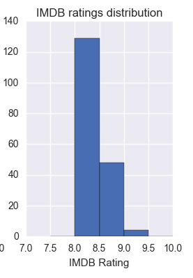
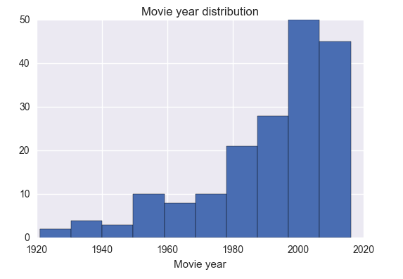
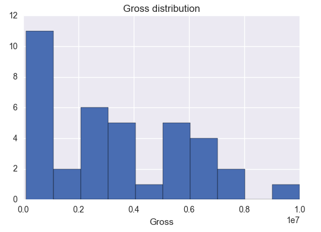
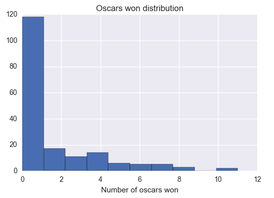
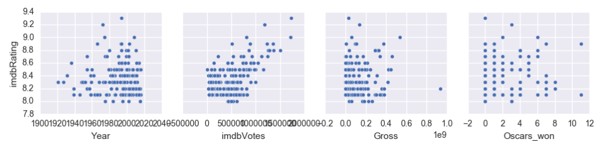
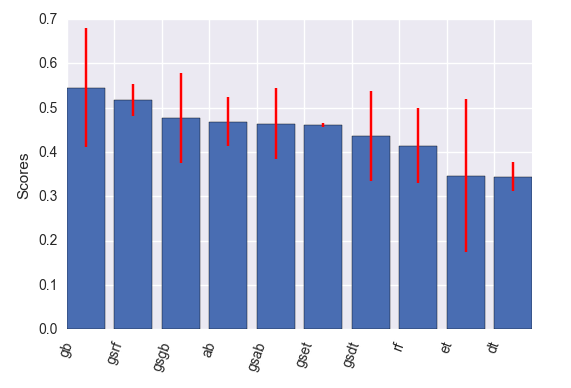
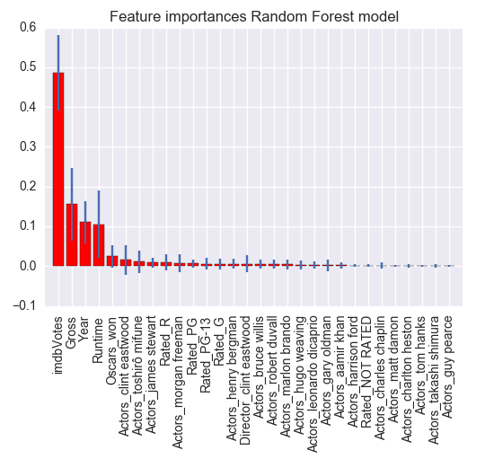

# What makes a movie successful?
What makes some movies so successful? How does a movie end up in the IMDB top 250 movies of all time? Are movie ratings influenced by factors like the number of academy awards it won, the gross it generated or simply the number of IMDB voters?
We built a regression tree model to try and see if some of these factors influenced a movie's IMDB score. We trained and tested our model on the IMDB top 250 movies of all time and extracted its most relevant features.

## What kind of movies are included in IMDB's top 250 movies?

Top 250 movies scores range between 8 and 9.3.
21 directors have more than three movies in the top. Five directors have seven movies in the top (a maximum): Christopher Nolan, Steven Spielberg, Stanley Kubrick, Martin Scorsese and Alfred Hitchcock.

The top includes movies dating from 1921 to 2016.
55.8% are from the 20th century and 44.2% from the 21st century.

Their gross products range between $10,177 and $936,627,416. The lowest gross product is associated with a movie from 1950. The highest is from a 2015 movie.

The highest number of academy awards ever won by a movie is 11. It has been achieved by three movies, two of which are in the top: The Lord of the Rings: The Return of the King	and Ben Hur. However, the third movie - Titanic - isn't in the top.

From these plots, we can see that imbd scores seem to be positively correlated with the number of votes and the gross.

## Which model performed best to predict imbd scores?

Five models were tested and optimised to try and model imdb scores: decision tree, random forest, ada boost, gradient boosting trees and extra trees.
We compared cross validated r2 scores of these models and based on the graph below, we concluded that the random forest algorithm was the most performant.

## Most relevant features

Based on the random forest model, the most relevant features in predicting imdb scores are the number of votes, the gross, the movie's year and its runtime.
