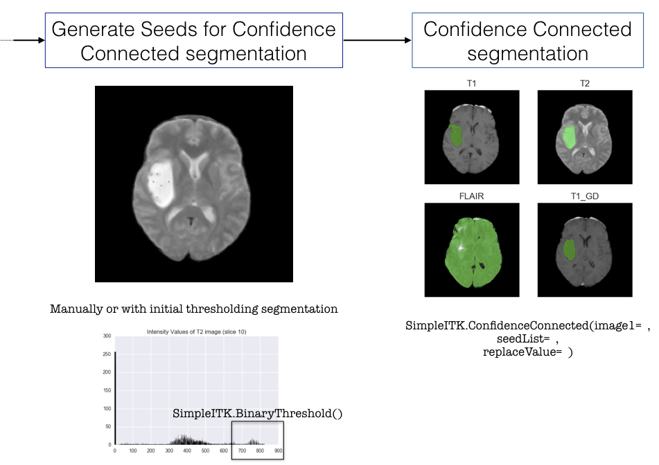

Jupyter notebooks and presentation slides for this project can be found in this [GitHub repository](https://github.com/ChloePont/Brain_tumour_classification_project)

Brain tumours are among the most fatal cancers in the western population. Gliomas (tumours that arises from glial cells) are the most frequent type of primary brain tumours (70%). In this project, we will focus on trying to differentiate three types of gliomas: Astrocytomas, Oligodendrogliomas and Glioblastomas (GBM). In particular isolating GBMs can be particularly important as they tend to be very aggressive tumours and grow rapidly.

 <i> Average survival length (in months) per tumour types based on the Repository of Molecular Brain Neoplasia Data (REMBRANDT) </i> 

Magnetic Resonance Imaging (MRI) is the imaging technique of choice for brain tumour diagnosis. Therefore this project will focus on MRI brain scans to try and determine a patient's tumour type.    
A typical MRI exam usually includes images of the brain along different planes (axial, cortical or sagittal). MRI exams also include different types of sequences which allow tissues to appear in different intensities according to the type of sequence. In particular, four types of sequences are usually used in brain MRI exams:   
  * T1-weighted images (T1): on these images fat appears brighter and fluids darker
  * T1-weighted images with contrast enhancement (T1GD): T1 images after intravenous injection of a contrast agent (gadolinium)
  * T2-weighted images (T2): on these images fluids appear brighter and fat darker
  * T2-weighted images with fluid attenuated inversion recovery (FLAIR): T2 images where fluids are removed   
In this project we will consider T1, T2, FLAIR and T1GD axial images.   

### Problem statement
Typically to classify a brain tumour, radiologists and neurologists would go manually through MRI scans (and possibly additional imaging modalities) to locate the tumour and extract information. However going through over a hundred images per patient can be a tedious and time-consuming process.    
Could we accelerate this process by pre-classifying brain tumours based on their MRI scans before a radiologist starts looking at them?    

### Dataset
Based on the Repository of Molecular Brain Neoplasia Data (REMBRANDT) available on the [Cancer Imaging Archive website](https://wiki.cancerimagingarchive.net/display/Public/REMBRANDT#4b0fe4760f6d405e9d09ad75c6f54790), we will aim at building a classifier that can differentiate Astrocytomas, GBMs and Oligodendrogliomas based on their MRI scans.
The REMBRANDT data contains three different sets of materials:   
  * A CSV file containing the diagnosis and survival time of 127 patients
  * MRI scans for these 127 patients
  * A CSV file containing 30 tumour features (VASARI features) extracted manually by three neuroradiologists from the MRI scans of 32 patients (glioblastoma, n = 20; oligodendroglioma, n = 7; astrocytoma, n = 5), such as side of tumour epicenter, enhancement quality, necrosis, size, etc.   

### Process
 1. We will first try to build a classifier based on the features manually extracted by radiologists.
 2. We will then try to extract these features from the MRI scans and make sure that they match those from the CSV file. According to the literature on brain tumour classification, this step will require:
  * Selecting the relevant images to be analysed (out of over 100 per patient)
  * Filtering them to remove the noise inherent to all MR images
  * Skull stripping
  * Segmenting the image to isolate the tumour
  * Extracting relevant features
 3. We will then run the same model on the features extracted automatically for the first 32 patients and make sure that we get similar results to the manually extracted features.
 4. Finally we will classify the remaining 95 patients to get an unbiased estimate of our model's performance.

### Goal and success criteria
Our goal is to build a classifier that performs better than the baseline: 62.5% accuracy for the 32 patient dataset and 42.34% for the whole dataset.    
We would like to predict probabilities of each tumour type in order to assist radiologists in their diagnosis. We will compare several models (such as Logistic Regression, Naive Bayes and Random Forest) based on their accuracy, confusion matrices and ROC curves and select the most relevant one. We will also try to trim the number of features to improve our model.   

## 1. Building a classifying model based on VASARI features manually extracted by radiologists (32 patients)

 <i> Diagnosis of the 32 patients for whom VASARI features were manually extracted </i>
  

Based on the manually extracted tumour features from 32 patients, we built a classifier to predict tumour types. Based on the above graph, the baseline accuracy for this dataset is 62.5%.   

### a. Model selection
We initially tested five models on the 30 VASARI features and either optimised them using sklearn's GridSearchCV (models 1, 2 and 3) or cross-validated them (4 and 5):  
  1. Logistic Regression (logreg)
  2. k-Nearest Neighbours (knn)
  3. Random Forest Classifier (rfc)
  4. Linear Discriminant Analysis (lda)
  5. Naive Bayes (nbm)   

We then tried to reduce the number of features to improve the model's performance using three different methods:   
  * Random Forest Feature Importances (rf3)
  * SelectKBest (kbest)
  * Recursive Feature Elimination on logistic regression (logreg_rfe) and random forest classifier (rfc_rfe)   

The cross-validated accuracies of all models are displayed in the graph below.

 <i> Model scores </i> 

Based on the above graph and the fact that the features selected the four techniques were very similar (in particular the top 3 features for Random Forest, SelectKBest and RF RFE were the same), the **random forest model with five SelectKBest features** was selected to classify tumour types.   

The five selected features are as follows:   
  * Enhancement Quality
  * Thickness of Enhancing Margin
  * Proportion of non-Contrast Enhancing Tumour (nCET)
  * Proportion of Necrosis
  * Proportion of Enhancing Tumour   

The graphs below show the variations of these features according to the tumour type as well as the correlations between each feature.

 <i> Features distributions according to tumour types </i>

 <i> SelectKBest (k=5) features correlations* </i>

Based on the first graph these features seem relevant to differentiate tumour types. However these features also seem to be correlated. Also, since we only have 32 samples in our dataset so far the model might be overfitting and might not generalise well on another dataset.   

### b. Model performance - Random forest model with five best features
*Please note that at this stage we are unable to provide an unbiased estimation of future performance as our dataset is too small to be split into training/validation and test sets - the below scores include a selection bias. Unbiased performance will be assessed once relevant features have been extracted from the remaining 98 patient images for which we do not have a record of manually extracted features.*  

The model's cross-validated accuracy (with selection bias) is 90.5% +/- 1.2%.   

Based on this model we are able to provide probabilities for each tumour to be of a certain type. For instance, according to our model the first patient - who has an astrocytoma - has the following probabilities:    
| Astrocytoma	| GBM	| Oligodendroglioma |
|:-----------:|:---:|:-----------------:|
| 88%	        | 0%	| 12%               |
|----

A ROC Curve of the model predicting whether a tumour was a GBM or not is displayed below. With an area under the curve of 0.94, the model seems to be performing very well on this small dataset.

 <i> ROC Curve of the model predicting GBM tumours </i> 
  

## 2. Image analysis and features extraction from MRI scans
In order to analyse and extract features from MRI scans, we tested several python libraries such as pydicom, skimage, SimpleITK, BrainSuite and FSL. In the end we decided to use SimpleITK and FSL (for skull stripping) as they contained many ready-to-use tools for brain imaging.
The workflow that was followed is described in the images below.   

After pre-processing the image we decided to segment the tumour using SimpleITK's Confidence Connected filter. However this method requires manually selecting points inside the tumour before applying the filter, therefore it has proven difficult to automate this method (ideally we would like to write a function or a pipeline that processes all the images automatically). We still have not been able to resolve this issue at the moment.  

After tumour segmentation, we wanted to extract tumour features such as size and intensity levels on different types of sequences. We managed to extract geometric properties of the tumour as well as some intensity levels, however we did not manage to extract intensity ratios. Indeed all images in the database have been taken with slightly different parameters therefore the resulting image intensities are all different and cannot be compared in their absolute values (we cannot set an intensity threshold to identify tissue types). This is the second issue that we will need to solve in order to analyse the images.  

## Conclusion
In summary, we have been able to build an accurate model to classify brain tumours based on a dataset of 32 patients whose tumours had been manually analysed by radiologists. However we still need to get more data out of the MRI scans of the remaining 98 patients in order to get an unbiased estimate of our model's performance. For this we will need to automate tumour isolation on the scans as well as determine a reproducible method to extract tumour intensity features.   

    
## References:
 * Scarpace L, et al. Data From REMBRANDT. *The Cancer Imaging Archive.* 2015 http://doi.org/10.7937/K9/TCIA.2015.588OZUZB  
 * Clark K, et al. The Cancer Imaging Archive (TCIA): Maintaining and Operating a Public Information Repository. *Journal of Digital Imaging.* 2013;26(6):1045-1057.  
 * Bauer S, et al. A survey of MRI-based Medical Image Analysis for Brain Tumor Studies. *Phys Med Biol.* 2013;58(13):R97-129.  
 * Kyrre EE, et al. Automatic Glioma Characterization from Dynamic Susceptibility Contrast Imaging: Brain Tumor Segmentation Using Knowledge-Based Fuzzy Clustering. *J Magn Reson Imaging.* 2009;30(1):1-10.   
 * Sharma K, et al. Brain Tumor Detection based on Machine Learning Algorithms. *IJCA.* 2014;103(1).  
 * Velazquez ER, et al. Fully automatic GBM segmentation in the TCGA-GBM dataset: Prognosis and correlation with VASARI features. *Sci Rep.* 2015;8(5):16822.  
 * Despotović I, et al. MRI Segmentation of the Human Brain: Challenges, Methods, and Applications. *Computational and Mathematical Methods in Medicine.* 2015;6:1-23.  
 * PyScience blog, https://pyscience.wordpress.com/  
