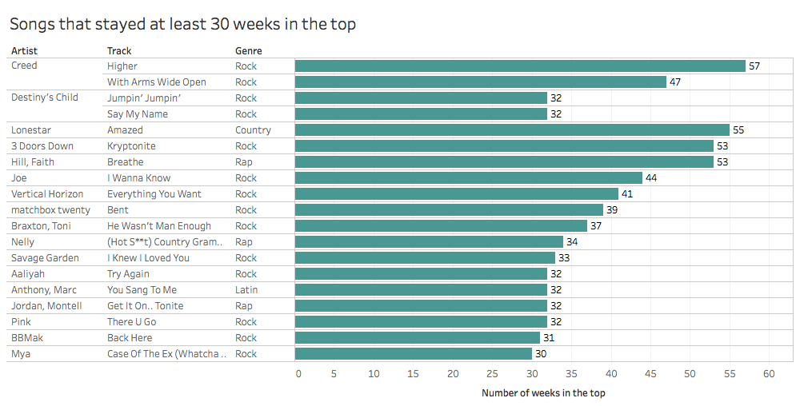

# What happened in the music charts in 2000?

At the beginning of this century, music tastes were quite similar to what they are now. Based on the billboard top 100 chart of year 2000 we will see that most of the artists who reached number 1 in the top are very much still present in the charts today.
We will also see some interesting results on the ranking evolution of the charts that reached number one during year 2000.

## What did we listen to in 2000?

As you can see, the genre that was most represented in the 2000 charts was Rock. Over 40% of the songs that were in the top 100 in 2000 were Rock songs.
Along with Country and Latin, it was the only genre that had songs reach number 1 in the top. Out of the 17 songs that reached number 1 in 2000, 15 were Rock songs.

## Which songs were the most popular?

317 songs were in the top 100 in year 2000. Four songs only stayed for a week. Some songs left the top and reentered it at a later date. On average songs stayed less than 17 weeks in the top.

### Songs that stayed in the top the longest

The following songs stayed in the top for over 30 weeks.

'Higher' from Creed stayed in the top the longest, for 57 weeks in total.

### Songs that reached number one

Comparatively, the following songs are the songs that reached number 1.

On average, songs that reached number one stayed for 30.41 weeks in the top. Only 40% of them stayed for over 30 weeks in the top.

Their ranking evolutions in the top were as follows:

It is interesting to see that the songs that stayed in the top the longest do not necessarily reach the top position. And similarly songs that reached the top position do not necessarily remain in the top for very long.
